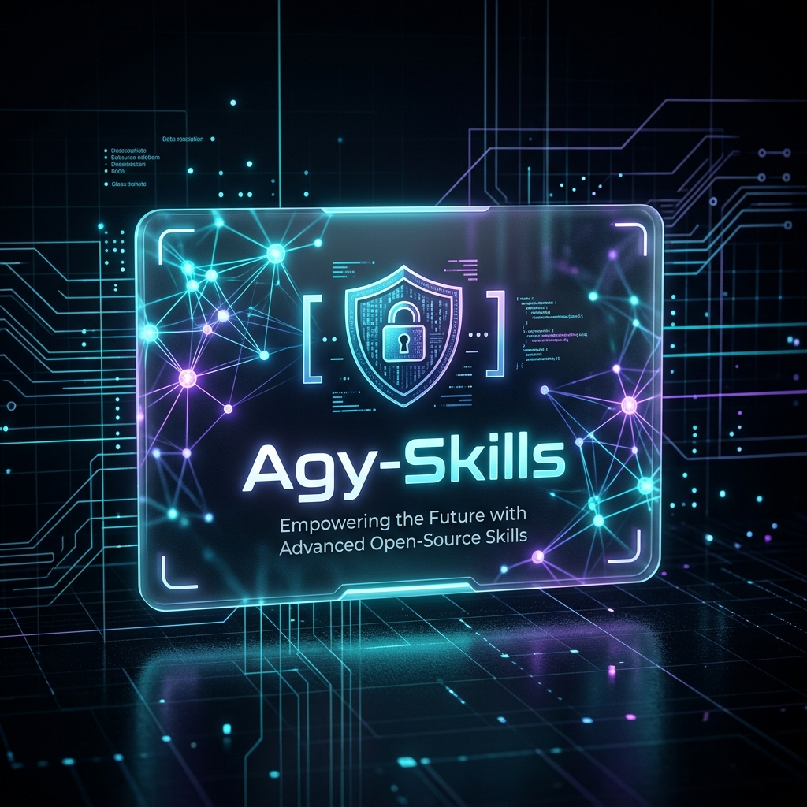

# 🛡️ Agy-Skills: Hardened Blueprints for Local AI Agent Workflows



Welcome to **Agy-Skills**! This repository contains a curated collection of standardized, security-first **AI Skill Blueprints** (written in Markdown) designed to guide advanced coding agents (such as Roo Code, Cline, Claude Code) and local LLMs (such as Ollama, Gemma 2, Llama 3) in executing operational and infrastructure workflows safely.

---

## 🏗️ The "Hardened Vanilla" Standard
All skills in this repository are engineered to enforce high-security postures during execution:
1.  **Least Privilege Runtime:** All system scripts, service containers, and processes are strictly configured to run under limited-privilege, non-root system accounts.
2.  **Zero plain-text Secrets:** No credentials, API tokens, database connection strings, or private keys are ever hardcoded or printed to the screen/logs. Output is dynamically masked using `********` patterns.
3.  **Atomic Write Operations:** File operations (like generating spreadsheets, Word documents, or writing configurations) utilize temp-then-rename atomic write workflows to prevent file corruption.
4.  **Path Traversal Protection:** All file reading/writing tools must sanitize paths, verify offsets, and reject traversal attempts trying to step outside authorized workspaces.

---

## 📂 Active Skill Library

The repository is structured logically by domain categories:

```bash
agy-skills/
├── README.md
├── agy_skills_cover.png                  # Project cover banner
├── data/
│   ├── analyzing_data.md                 # Cleanup metrics logs & compile Excel summaries
│   └── designing_apis.md                 # REST/GraphQL endpoints design & OpenAPI 3.1 specs
├── devops/
│   ├── browser_testing.md                # E2E browser automation & Lighthouse audits
│   ├── managing_cicd.md                  # GitHub Actions, secrets mapping & pinned runners
│   └── managing_containers.md            # Multi-stage, non-root Docker builds & diagnostics
├── network/
│   └── general_network_audit.md          # Hardening management protocols & vetting unused ports
├── operations/
│   ├── client_onboarding.md              # Structured client onboarding lifecycle
│   ├── creating_agy_mcps.md              # Automate blueprinting & git deployment of custom MCP servers
│   ├── creating_agy_skills.md            # Automate blueprinting & git deployment of custom Agy-skills
│   ├── documenting_sessions.md           # Private daily reviews & .gitignore automation
│   ├── executing_sop_and_runbooks.md     # Step-by-step interactive runbook execution
│   ├── managing_m365.md                  # Administer M365 users, licenses, and security
│   ├── managing_system_operations.md     # Sorting folder assets & executing tar backups
│   ├── patch_management.md               # Govern patch windows and rollback policies
│   └── powershell_automation.md          # Write, test, and deploy PowerShell automation
└── security/
    ├── database_management.md            # PostgreSQL schemas, indices, permissions & migrations
    ├── incident_response.md              # Triage, contain, investigate, and recover from incidents
    ├── managing_secrets_and_vaults.md    # In-memory secrets injection & vault bridge operations
    ├── sec_engineer.md                   # Hardened Vanilla enforcement & STRIDE threat modeling
    └── resources/                        # Progressive disclosure language/platform directives
```

### 🧠 Summarized Skill Index

*   **[Security Engineer](security/sec_engineer.md):** Senior Security Solutions Architect and Lead DevSecOps Engineer. Enforces security mandates, STRIDE modeling, and has Veto Power.
*   **[SOP & Runbooks Orchestrator](operations/executing_sop_and_runbooks.md):** Guides the agent through a safe, sequential **Validate $\rightarrow$ Execute $\rightarrow$ Verify** lifecycle when executing complex technical SOPs, database migrations, or server maintenance scripts.
*   **[Session Review Documenter](operations/documenting_sessions.md):** Tracks local work sessions, hides the private `CHG-Review` logs directory, and automatically manages `.gitignore` rules to keep diaries private.
*   **[Docker Container Specialist](devops/managing_containers.md):** Formulates highly optimized, secure multi-stage Dockerfiles and Compose files, verifying process states, maps, and volumes.
*   **[Secrets & Credentials Guard](security/managing_secrets_and_vaults.md):** Audits `.gitignore` files, runs dynamic log scrubbers, and safely retrieves or rotates credentials using secret vaults.
*   **[Spreadsheets & Data Analyst](data/analyzing_data.md):** Cleans telemetry log inputs, filters duplicate records, standardizes ISO 8601 datetimes, and compiles structured markdown tables or Excel spreadsheets.
*   **[Personal System Administrator](operations/managing_system_operations.md):** Automates repetitive folder cleanups, manages local compressed backup files (retaining max 5 history logs), and verifies disk allocations.
*   **[Agy-Skills Automator](operations/creating_agy_skills.md):** Generates and deploys new security-first operational skill files inside the local Agy-Skills repository.
*   **[Agy-MCP Automator](operations/creating_agy_mcps.md):** Designs, blueprints, and structures custom Model Context Protocol (MCP) server configurations.
*   **[Browser Testing Specialist](devops/browser_testing.md):** Automates browser E2E workflows, visual regressions, and Lighthouse audits.
*   **[Database Security Administrator](security/database_management.md):** Governs database schemas, indexes, role separation, and DDL migrations.
*   **[CI/CD Pipeline Specialist](devops/managing_cicd.md):** Configures automated pipelines, dependency audits, and secrets mapping.
*   **[API Architect & Designer](data/designing_apis.md):** Designs RESTful and GraphQL API contracts, schemas, and OpenAPI 3.1 YAML specifications.
*   **[General Network Auditor](network/general_network_audit.md):** Audits and hardens network configurations, management protocols, and ports.
*   **[Client Onboarding Specialist](operations/client_onboarding.md):** Coordinates tenant, network discovery, credential vaulting, and monitoring baseline setups during client onboarding.
*   **[Microsoft 365 Administrator](operations/managing_m365.md):** Governs user provisioning, deprovisioning workflows, licensing, MFA checks, and Conditional Access policies.
*   **[Patch Management Specialist](operations/patch_management.md):** Controls patch inventory, risk gating, pre-patch backups, staged deployment, and rollback configurations.
*   **[PowerShell Automation Specialist](operations/powershell_automation.md):** Scripting authority enforcing strict parameter validation, SecureString management, and Pester tests.
*   **[Incident Response Specialist](security/incident_response.md):** Governs triage, containment, log preservation, and recovery workflows during security incidents.

---

## 🚀 How to use this in your AI client
To equip your local AI coding agent (e.g., Roo Code or Cline) with these skills:

1. Copy the skill file (e.g., `executing_sop_and_runbooks.md`) that you want your agent to learn.
2. Paste the contents directly into your project's custom instructions directory (such as `.clinerules` or `.roo-code-instructions` or a local `skills/` directory).
3. Trigger the skill in your chat conversation:
   > *"Based on my public runbook skill instructions, execute the server backup SOP."*

---
_Feel free to open Pull Requests to contribute new blueprints, refine checklists, or add vendor-specific system configurations!_
