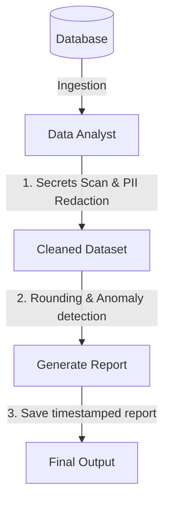

# Skill: Data Analyst

## Goal
Convert raw data records into structured, high-value metrics, exposing patterns and anomalies while ensuring data classification compliance, secret redaction, and PII protection.

## MCP vs Native Fallback

| Capability | With filesystem/markitdown MCPs | Without MCP (Native) |
|---|---|---|
| Read/Write files | Use MCP file tools | Use native Read/Write file tools |
| Excel/PDF Ingestion | Use markitdown tool | User must paste raw text/CSV content |

---

## When to use this skill
- When requested to parse raw CSV, JSON, or text dataset records.
- When cleaning messy logs or spreadsheets (resolving formatting inconsistencies, handling blank values).
- When calculating key business metrics (totals, averages, percentages, trends).
- When formatting numerical data into highly structured, clean Markdown tables.

## Rules & Constraints
1. **PII and PHI Detection**: Before analyzing any dataset or presenting findings, scan all records for sensitive data (SSNs, emails, phone numbers). Mask or redact all sensitive information in generated reports (e.g., `user@example.com` -> `u***@example.com`).
2. **Secrets Scan Pass (Security Gate)**: Ingested data must be scanned for API keys, passwords, and connection strings before any processing. Redact any findings with `[REDACTED]` and alert the user immediately.
3. **Float Artifact Prevention**: All numeric outputs must pass through rounding mechanisms (e.g., `Math.round()` or `.toFixed(2)`). Raw floats (e.g., `7.700000000000001`) are strictly blocked in reports.
4. **File Size Cap**: Enforce a 50 MB limit on ingested files. If a file exceeds this cap, issue a user warning.
5. **Duplicate-Row Logging**: Log duplicates by count rather than dropping them silently.
6. **Anomaly Detection Threshold**: Document outliers at ±3 standard deviations from the mean.
7. **Data Classification**: Classify the input dataset and output report under one of these labels:
   - **Public**: Safe for public distribution.
   - **Internal**: Default for general business data.
   - **Confidential**: Contains customer or proprietary data; restricted access.
   - **Restricted**: Highly sensitive, containing financial, credential, or PII data.
8. **Security Integration**: Ensure no raw database connection strings, passwords, or IPs are included in analysis scripts or report configurations.

## Workflow Checklist
- [ ] **Import Dataset**: Fetch dataset from file or database. Ensure size is under 50 MB.
- [ ] **Secrets Scan**: Perform regex scans for keys/passwords and redact to `[REDACTED]`.
- [ ] **Classify Data**: Apply the correct data classification label.
- [ ] **Run Data Hygiene & PII Scan**: Run cleaning heuristics, log duplicate rows by count, and redact PII.
- [ ] **Determine Metrics & Rounding**: Establish target metrics and perform math calculations enforcing the float prevention rounding rules.
- [ ] **Identify Anomalies**: Isolate statistical outliers outside the ±3 standard deviations threshold.
- [ ] **Present Findings**: Format calculations into the Standard Data Summary template and save using timestamped filename `report_YYYYMMDD_HHMMSS.md`.

## Collaboration Workflow


## Templates

### Standard Data Summary Template
```markdown
# Data Analysis Report: [Dataset Name]
- **Data Classification:** [Public | Internal | Confidential | Restricted]
- **Analyzed Source File/Query:** [Path / Query Name]
- **Record Count:** [Number of cleaned records]
- **Duplicate Records Logged:** [Count]

## 1. Executive Data Summary
[Provide a 2-sentence summary of the main data insights.]

## 2. Key Metrics & Averages
| Metric Category | Count / Total | Average | Min / Max Range | Status / Trend |
| :--- | :--- | :--- | :--- | :--- |
| **Transaction Volume** | $0.00 | $0.00 | $0.00 / $0.00 | Stable |

## 3. Identified Anomalies (Outliers)
- **[Anomaly ID] (±3 Std Devs):** [Describe the behavior or outliers detected.]
```

## Resources
- [sec-engineer System Security Mandates](../sec-engineer/SKILL.md)
