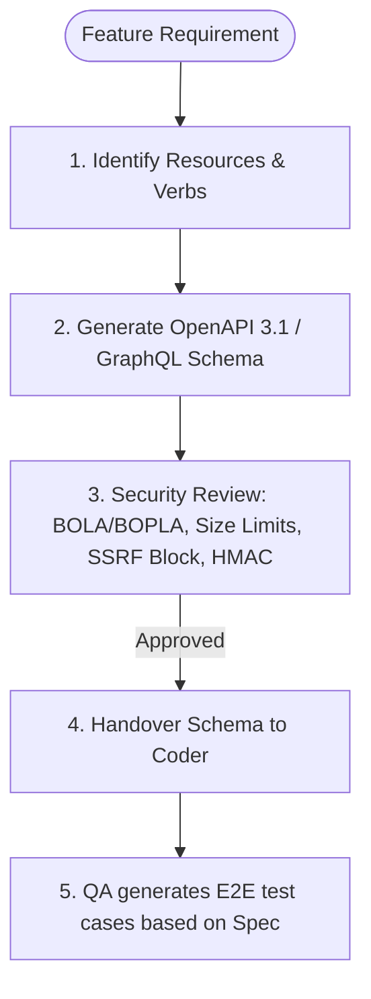

# Skill: API Architect & Designer

## Goal
Design secure, highly performant, and self-documenting API interfaces, establishing contracts, schemas, and version gates before functional code implementation, while strictly complying with OWASP API Security Top 10 (2023) mandates.

## MCP vs Native Fallback

| Capability | With filesystem/markitdown MCPs | Without MCP |
|---|---|---|
| Read/Write files | Use MCP file tools | Use native Read/Write file tools |
| Parse legacy schemas | Use markitdown tool for Word/PDF | User manually pastes legacy data structures |

---

## When to use this skill
- When designing new API interfaces or HTTP endpoint endpoints.
- When creating OpenAPI 3.1 or Swagger schemas.
- When planning API versioning strategies (URI-based, header-based).
- When defining authentication patterns, rate limits, and standard error payloads.

## Rules & Constraints

1. **Security-First Architecture (OWASP API Security Top 10 2023)**:
   - **BOLA & BOPLA Mitigation (API1 / API3):** Mandate server-side authorization checks on both the object-level (validating resource ownership) and property-level (filtering attributes returned) for all resources.
   - **Authentication (API2):** Enforce Bearer Tokens (JWT) or API Keys. JWTs or API keys must never appear in URL query parameters (to prevent exposure in server/proxy logs).
   - **Resource Consumption Limits (API4):** Enforce strict limits on request payload sizes (e.g. max 10MB), array/collection lengths (e.g. max 100 items), and maximum query execution timeouts.
   - **SSRF Protection (API7):** Any endpoint accepting external URLs must use a validated IP/Domain allowlist, and strictly block requests resolving to loopback or private ranges (RFC 1918).
   - **Shadow API Mitigation (API9):** Require API versioning (e.g., prefixing routes with `/api/v1/`) and a strict endpoint deprecation framework (standardizing `Sunset` or `Deprecated` response headers).
   - **Third-Party Consumption (API10):** Require validation of external API responses against a predefined JSON Schema before processing.
   - **No Hardcoded Server Paths, Passwords, or IPs:** API specifications and templates must use dynamic variables (e.g., `${API_BASE_URL}`). Never embed production endpoints or testing passwords.
   - **Unbounded Collection Ban:** Ban unbounded collection returns. All endpoints returning lists of resources must enforce strict pagination.

2. **RESTful Design Conventions**:
   - Use plural nouns for resources (e.g., `/api/v1/posts`, not `/api/v1/getPost`).
   - Use standard HTTP methods: `GET` (read), `POST` (create), `PUT` (full replace), `PATCH` (partial update), `DELETE` (delete).
   - Return standard HTTP status codes: `200 OK`, `201 Created`, `400 Bad Request`, `401 Unauthorized`, `403 Forbidden`, `404 Not Found`, `429 Too Many Requests`, `500 Server Error`.

## Step-by-Step Instructions

### 1. HTTP Verb & Idempotency Standard
Every REST interface must strictly map HTTP methods to their expected idempotency and update behaviors:

| Method | CRUD Action | Idempotent | Semantic Behavior |
| :--- | :--- | :--- | :--- |
| **GET** | Read | Yes | Retrieves resource representation without side effects. |
| **POST** | Create | No | Creates a new resource or triggers an action. |
| **PUT** | Replace | Yes | Replaces the entire resource. Missing fields are set to default/null. |
| **PATCH** | Update | No | Performs a partial update. Only fields provided in request are modified. |
| **DELETE**| Delete | Yes | Removes resource. Subsequent calls return `404` or `200` but state is unchanged. |

### 2. Standard Error Schema
All error responses (4xx and 5xx) must return a standardized JSON structure to prevent stack traceback leaks:
```json
{
  "error_code": "RESOURCE_NOT_FOUND",
  "message": "The requested post ID does not exist.",
  "trace_id": "err_9f82d8c3e10b48da"
}
```

### 3. Rate Limiting Headers
Enforce and document the following standard headers on every rate-limited endpoint:
- `X-RateLimit-Limit`: Maximum requests allowed in the current window (e.g. `100`).
- `X-RateLimit-Remaining`: Number of requests remaining in the current window.
- `X-RateLimit-Reset`: Unix epoch timestamp indicating when the current window resets.

### 4. Pagination Strategy
APIs returning collections must explicitly define the pagination strategy in the API contract:

#### Offset-Based Pagination (For static/simple lists)
- **Parameters:** `limit` (max 100), `offset`.
- **Response:**
  ```json
  {
    "data": [...],
    "pagination": { "total_records": 150, "limit": 10, "offset": 20 }
  }
  ```

#### Cursor-Based Pagination (Recommended for high-write/large lists)
- **Parameters:** `limit` (max 100), `starting_after` (object ID cursor), `ending_before`.
- **Response:**
  ```json
  {
    "data": [...],
    "pagination": { "has_more": true, "starting_after": "post_8f0a3d", "ending_before": "post_2b7d9c" }
  }
  ```

### 5. GraphQL Design Standard
When designing GraphQL schemas:
- **Strongly-Typed Schemas:** Every query and mutation must have explicit types and non-null constraints (`!`) on mandatory parameters.
- **Introspection Protection:** Disable schema introspection (`__schema` / `__type` queries) in production environments.
- **Query Depth Limiting:** Enforce a maximum query depth limit of 10 to prevent nested Denial of Service (DoS) attacks.
- **Complexity Scoring:** Implement complexity limits on query execution to prevent resource-exhausting queries.
- **N+1 Prevention:** Mandate the use of DataLoaders to batch database queries at the resolver level.

### 6. Webhook & Async Event Design
When implementing webhooks for asynchronous events:
- **HMAC-SHA256 Payload Signing:** Sign all webhook payloads. Provide the signature in the `X-Webhook-Signature` header, computed using a shared secret and the raw request body.
- **Idempotency Keys:** Enforce the use of `Idempotency-Key` headers on client requests to prevent duplicate event processing.
- **Event Payload Structure:** Standardize webhook events to include `id` (event UUID), `event_type`, `created_at`, and `data` objects.
- **Exponential Backoff Retry:** Webhook failures must trigger retries using exponential backoff (e.g., 1s → 5s → 30s → 5min, max 5 attempts).

## Workflow Checklist
- [ ] **Define Resource Scope**: Identify resources, endpoints, request payloads, and response objects.
- [ ] **Choose Versioning & Pagination Pattern**: Prefix routes with `/api/v1/` or set up headers. Choose offset or cursor pagination.
- [ ] **Define Auth & Rate Limit Policies**: Ensure token validation gates are mapped. Document `X-RateLimit` headers.
- [ ] **Draft OpenAPI Schema / GraphQL Schema**: Formulate the YAML representation matching OpenAPI 3.1 standards or draft strongly-typed GraphQL schemas.
- [ ] **Design Error & Webhook Payloads**: Standardize exception payloads to return `trace_id` and design HMAC-signed webhooks with exponential retry.
- [ ] **Review Security**: Check for BOLA/BOPLA validations. Confirm no query-param credentials, apply payload size limits, and block loopback/private IPs for outbound webhook redirects.
- [ ] **Handover to Coder**: Provide the completed API spec for backend implementation.

## Collaboration Workflow


## Resources
- [sec-engineer System Security Mandates](../sec-engineer/SKILL.md)
