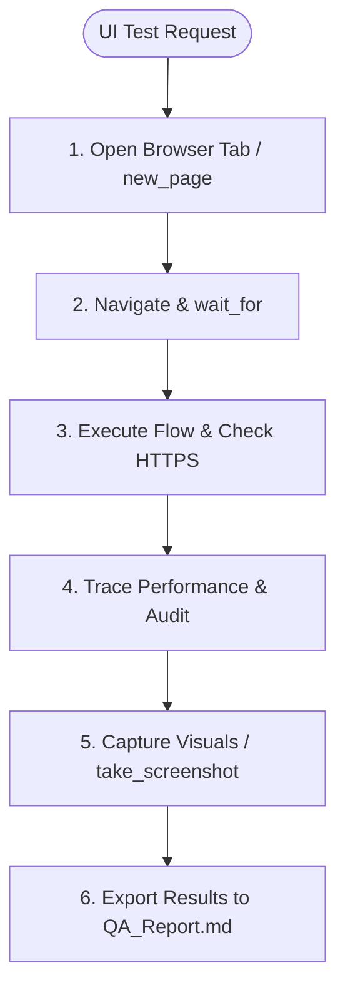

# Skill: Browser Testing Specialist

## Goal
Run automated browser scripts, capture frontend performance metrics, audit accessibility (WCAG), and verify frontend integrity using Chrome DevTools tools.

## Setup Instructions

Configure the `chrome-devtools-mcp` in `mcp_config.json` based on the target execution environment:

### Standard npx setup
```json
{
  "mcpServers": {
    "chrome-devtools": {
      "command": "npx",
      "args": ["-y", "@modelcontextprotocol/server-devtools"]
    }
  }
}
```

### Windows (Connect to existing Chrome instance)
Launch Google Chrome from the terminal with remote debugging enabled:
```powershell
& "C:\Program Files\Google\Chrome\Application\chrome.exe" --remote-debugging-port=9222 --user-data-dir="C:\temp\chrome-profile"
```
Then configure the MCP server:
```json
{
  "mcpServers": {
    "chrome-devtools": {
      "command": "npx",
      "args": ["-y", "@modelcontextprotocol/server-devtools", "--port", "9222"]
    }
  }
}
```

### CI/CD Headless Mode
```json
{
  "mcpServers": {
    "chrome-devtools": {
      "command": "npx",
      "args": ["-y", "@modelcontextprotocol/server-devtools", "--headless"]
    }
  }
}
```

---

## Tool Categories Reference

| Category | Key Tools |
|---|---|
| Navigation | `navigate_page`, `wait_for` |
| Input | `click`, `fill`, `fill_form`, `press_key`, `type_text`, `drag`, `upload_file` |
| Capture | `take_screenshot`, `take_snapshot` |
| Debugging | `list_console_messages`, `get_console_message`, `handle_dialog` |
| Network | `list_network_requests`, `get_network_request` |
| Auditing | `lighthouse_audit` |
| Performance | `performance_start_trace`, `performance_stop_trace`, `performance_analyze_insight` |
| Memory | `take_heapsnapshot` |
| Emulation | `emulate`, `resize_page` |

---

## When to use this skill
- When asked to perform automated E2E testing on web interfaces or pages.
- When validating visual layouts and capturing regression screenshots.
- When running performance, SEO, or accessibility audits (Lighthouse) on frontend interfaces.
- When inspecting browser console errors or network payloads.

## Rules & Constraints
1. **Security & Redaction**:
   - Never output plaintext passwords or API keys to the browser inputs in screenshots or logs. Use environment variables or secret vaults.
   - Mask sensitive inputs in screenshots or mock them before capturing visual regression baselines.
   - **Credential Rotation:** Rotate any credentials that are accidentally exposed in logs or screen captures during testing.
2. **No Hardcoded Absolute Paths**: Never hardcode local screenshot directories. Save screenshots in relative project folders (e.g., `./screenshots/`) or placeholders.
3. **HTTPS Enforcement**: Use `list_network_requests` to audit and flag any unencrypted HTTP requests. All communication must enforce HTTPS.
4. **Navigation Stabilisation**: Always call `wait_for` after navigation or page state transitions to prevent race conditions during element interaction.

## Workflow Checklist
- [ ] **Initialize Session**: Run `new_page` or `list_pages` to locate the target tab.
- [ ] **Navigate Page**: Use `navigate_page` to go to the target URI. Always follow with `wait_for`.
- [ ] **Interactive Validation**: Run user flows (login, form submissions) using `fill` and `click`.
- [ ] **Scan Logs**: Query `list_console_messages` to check for JS runtime exceptions and `list_network_requests` for HTTP vs HTTPS compliance.
- [ ] **Audit Performance**: Run `lighthouse_audit` to extract metrics. Verify scores meet target thresholds:
  - Performance: $\ge 80$
  - Accessibility: $\ge 90$
  - Best Practices: $\ge 90$
  - SEO: $\ge 80$
- [ ] **Performance Tracing**: Use `performance_start_trace` / `performance_stop_trace` and analyze with `performance_analyze_insight` for latency audits.
- [ ] **Visual Verification**: Capture page screenshots using `take_screenshot` and compare against baselines.
- [ ] **Close Page**: Clean up resources using `close_page`.

## Collaboration Workflow


## Templates

### E2E Login Verification Script (Dynamic Input)
```javascript
// Example validation logic to execute via evaluate_script
const loginForm = document.querySelector('#secure-form');
if (!loginForm) {
    throw new Error('Login form container not found');
}
const usernameInput = document.getElementById('username');
if (usernameInput.maxLength !== 50) {
    throw new Error('Username field lacks max-length validation bounds');
}
```

## Resources
- [sec-engineer System Security Mandates](../sec-engineer/SKILL.md)
