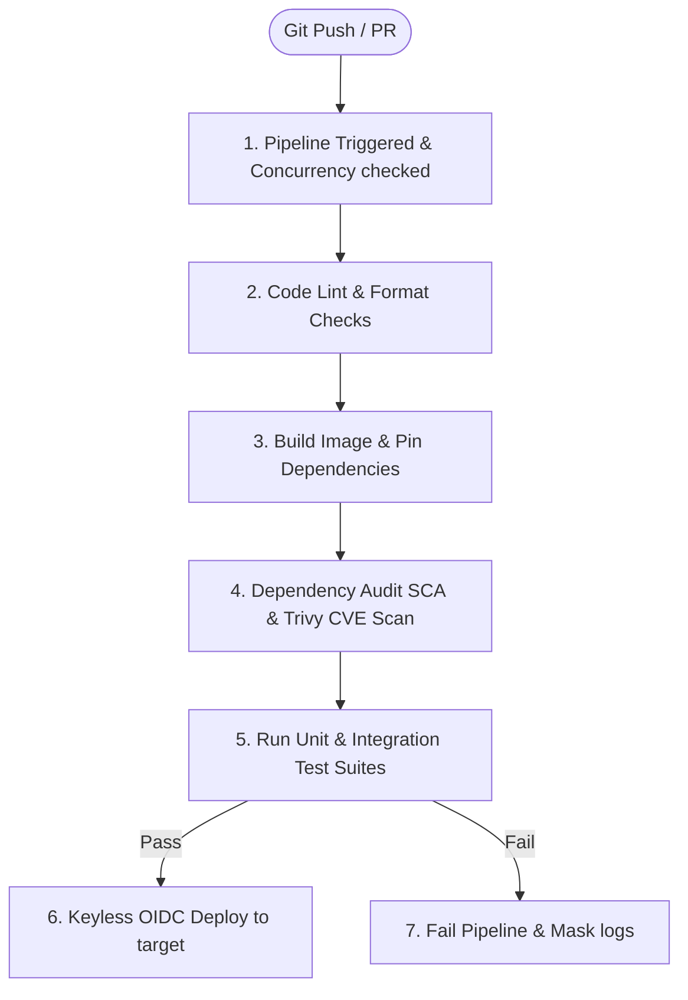

# Skill: CI/CD Pipeline Specialist

## Goal
Design secure, efficient, and robust pipelines, ensuring that all code is validated, compiled, and deployed using least-privilege runners, keyless OIDC authentication, and encrypted secret mappings while preventing Poisoned Pipeline Execution (PPE).

## MCP vs Native Fallback

| Capability | With filesystem/git MCPs | Without MCP |
|---|---|---|
| Read/Write files | Use MCP file tools | Use native Read/Write file tools |
| Git operations | Use git MCP tools | PowerShell: run git commands directly |

---

## When to use this skill
- When asked to configure automated build, test, or deploy scripts.
- When creating or modifying workflow files (e.g., `.github/workflows/main.yml`).
- When setting up multi-stage deployment environments (dev, staging, production).
- When configuring automated security tests or dependency scans within pipelines.

## Rules & Constraints

1. **Security-First Pipeline Hardening (OWASP Top 10 CI/CD Security Risks)**:
   - **Poisoned Pipeline Execution (PPE) Prevention (CICD-SEC-4):** Mandate branch protection rules on CI/CD configuration files (requiring pull request approvals). Ensure untrusted pull requests (e.g. from forks) cannot execute with write access or access secrets.
   - **Least Privilege Identity & Access (CICD-SEC-2):** Restrict runner permissions by default (`permissions: contents: read`) and require explicit opt-in for write scopes. Pin all third-party Actions to static SHA hashes.
   - **Dependency Chain Abuse Mitigation (CICD-SEC-3):** Run Software Composition Analysis (SCA) to verify dependency integrity.
   - **Artifact Integrity Validation (CICD-SEC-9):** Enforce build artifact signing (e.g., Cosign) to verify provenance before deployment.
   - **No Hardcoded Secrets:** Pipeline configuration files must never contain plaintext secrets, passwords, or API keys. Inject credentials dynamically at runtime.
   - **Runner Least Privilege:** Enforce minimal permissions on all pipeline execution environments. Never run actions or scripts with root permissions unless explicitly required and isolation-verified.

2. **Performance & Cleanups**:
   - **Concurrency Groups:** Set up concurrency rules to cancel in-progress runs on new pushes, preventing build queue build-ups and resource exhaustion.
   - **Cache Invalidation:** Use lockfile-based cache key hashing, establish explicit TTLs, and never cache files containing build secrets.

## Step-by-Step Instructions

### 1. OIDC Keyless Authentication
Avoid long-lived cloud credentials (like AWS Access Keys) stored in CI secrets. Implement OpenID Connect (OIDC) to request short-lived identity tokens dynamically:
```yaml
permissions:
  id-token: write # Required for requesting the JWT
  contents: read  # Required for actions/checkout

steps:
  - name: Configure AWS Credentials via OIDC
    uses: aws-actions/configure-aws-credentials@v4 # Pin to static SHA in prod
    with:
      role-to-assume: arn:aws:iam::123456789012:role/my-github-actions-role
      aws-region: us-east-1
```

### 2. Pipeline Concurrency Control
Configure concurrency groups at the top level of the workflow to automatically cancel obsolete builds:
```yaml
concurrency:
  group: ${{ github.workflow }}-${{ github.ref }}
  cancel-in-progress: true
```

### 3. Secrets Masking in Logs
When executing scripts that generate dynamic passwords or access tokens, enforce log masking to prevent leaks:
```bash
# Mask dynamically generated secret in GitHub Actions logs
echo "::add-mask::$DYNAMIC_SECRET"
```

### 4. Matrix Build Strategy
Optimize build times across multiple platforms or versions using matrix configurations with safety gates:
```yaml
strategy:
  matrix:
    os: [ubuntu-latest, windows-latest]
    node-version: [18.x, 20.x]
  fail-fast: false # Prevent one OS failure from immediately killing all other matrix jobs
```

### 5. Dependency & Cache Hardening
Configure caching using precise lockfile hashes. Ensure cache directories are scoped and do not leak build artifacts containing credentials:
```yaml
- name: Cache Node Modules
  uses: actions/cache@v4 # Pin to SHA in prod
  with:
    path: ~/.npm
    key: ${{ runner.os }}-node-${{ hashFiles('**/package-lock.json') }}
    restore-keys: |
      ${{ runner.os }}-node-
```

### 6. Vulnerability Scanning & SARIF Reports
Integrate static application security testing (SAST) and software composition analysis (SCA) into the pipeline. Export results as SARIF files to integrate directly with repository security tabs:
```yaml
- name: Run Dependency Audit
  run: pip-audit --format sarif --output audit-results.sarif
  continue-on-error: true

- name: Upload Scan Results to GitHub Security Tab
  uses: github/codeql-action/upload-sarif@v3 # Pin to SHA in prod
  with:
    sarif_file: audit-results.sarif
```

## Workflow Checklist
- [ ] **Define Pipeline Scope**: Map stages (Lint -> Build -> Test -> Security Scan -> Deploy) and configure concurrency groups.
- [ ] **Configure OIDC & Least-Privilege Scopes**: Ensure `permissions` block restricts token scopes to the absolute minimum needed (`id-token: write`, `contents: read`).
- [ ] **Draft Pipeline Config & Apply Version Pinning**: Write workflow in YAML format. Replace mutable Action tags with static SHA-1 commit hashes.
- [ ] **Secure Secrets & Masking**: Verify that zero secrets are hardcoded. Implement `::add-mask::` for any dynamically created secrets.
- [ ] **Audit Cache Configurations**: Verify cache keys are hashed against lockfiles and exclude credential-containing directories.
- [ ] **Incorporate Vulnerability Scans**: Add SAST/SCA scanners (Trivy, pip-audit, or CodeQL) and set up SARIF upload for security tracking.
- [ ] **Verify Execution**: Run a syntax check on the YAML schema and trigger a dry run.

## Collaboration Workflow


## Resources
- [sec-engineer System Security Mandates](../sec-engineer/SKILL.md)
