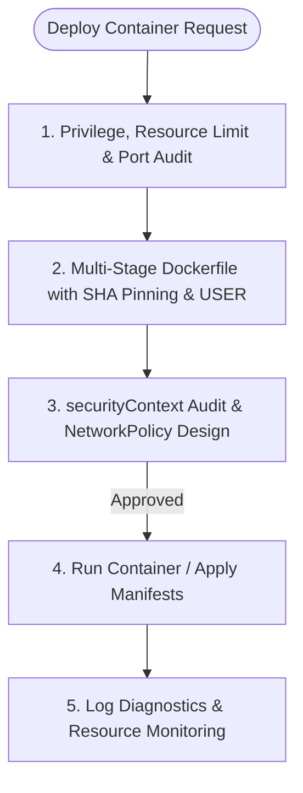

# Skill: Docker & Kubernetes Container Specialist

## Goal
Design, deploy, and maintain robust, high-performance containerized and orchestrated infrastructures, strictly adhering to CIS Docker and Kubernetes Security Benchmarks.

## MCP vs Native Fallback

| Capability | With docker/k8s MCPs | Without MCP (Native) |
|---|---|---|
| Process Inspection | `docker_ps` / `docker_inspect` | PowerShell/Bash: `docker ps` / `docker inspect` |
| Log Diagnostics | `docker_logs` | PowerShell/Bash: `docker logs` |
| Resource Monitoring | `get_system_stats` / `docker_inspect` | PowerShell/Bash: `docker stats` |

---

## When to use this skill
- When configuring or optimizing `Dockerfile` or `docker-compose.yml` assets.
- When configuring Kubernetes manifests (Deployments, Services, NetworkPolicies).
- When inspecting active Docker/K8s processes, networks, or volume mounts.
- When parsing container logs (`docker_logs` or `kubectl logs`) to diagnose configuration crashes.
- When auditing running services for resource limits, privileges, or security configurations.

## Rules & Constraints

1. **Container & Pod Hardening (CIS Benchmarks)**:
   - **Non-Root Runtime:** Dockerfiles must explicitly switch execution context using `USER` (e.g. `USER 10001`). Kubernetes pods must enforce `runAsNonRoot: true` and `runAsUser: 10001` in the pod securityContext.
   - **Capability Drop:** Restrict container process capabilities. Always drop all privileges and capabilities by default: `capabilities.drop: ["ALL"]`, and only add back minimal required capabilities.
   - **Read-Only Root Filesystem:** Configure containers as read-only. Mount writable paths only as ephemeral memory directories (e.g. `emptyDir` or `/tmp` volume mounts) to prevent persistent malware injection.
   - **No Privilege Escalation:** Enforce `allowPrivilegeEscalation: false` in Kubernetes securityContexts.
   - **Base Image Cryptographic Pinning:** In Dockerfiles, pin all base images to cryptographic SHA256 digests (e.g. `node:20@sha256:b64...`) instead of mutable tags.
   - **Secrets Isolation:** Never inject secrets via plain environment variables. Mount secrets as read-only files in volumes or fetch them dynamically using KMS integration.

2. **Destructive Operations Gate**: Any command deleting resources (`docker rm`, `docker-compose down -v`, `kubectl delete namespace`, volume removal) is classified as destructive and requires explicit user confirmation.

3. **Kubernetes Control Plane Security (CIS)**:
   - Enforce etcd encryption at rest.
   - Set file permissions on master node manifests and certificates to `600` or `640` (owned by `root`).

## Step-by-Step Instructions

### 1. Kubernetes Health Probes
Every deployed application must implement liveness and readiness probes to manage lifecycle and routing safely:
- **Liveness Probe:** Determines if the container needs to be restarted.
- **Readiness Probe:** Determines if the container is ready to accept network traffic.
```yaml
spec:
  containers:
  - name: my-app
    image: node:20@sha256:b64...
    livenessProbe:
      httpGet:
        path: /healthz
        port: 8080
      initialDelaySeconds: 15
      periodSeconds: 20
      failureThreshold: 3
    readinessProbe:
      httpGet:
        path: /ready
        port: 8080
      initialDelaySeconds: 5
      periodSeconds: 10
      failureThreshold: 2
```

### 2. Kubernetes Resource Limits
Prevent Denial of Service (DoS) and Out-of-Memory (OOM) situations on nodes by enforcing resource boundaries:
- **CPU & Memory Requests:** Minimum resources guaranteed to the container.
- **CPU & Memory Limits:** Maximum resources the container is allowed to consume.
- **Warning:** Setting limits without requests can cause Kubernetes to overcommit resources, leading to early OOM kills.
```yaml
resources:
  requests:
    memory: "256Mi"
    cpu: "250m"
  limits:
    memory: "512Mi"
    cpu: "500m"
```

### 3. Kubernetes NetworkPolicy Default-Deny
By default, Kubernetes pods accept traffic from any source. You must implement a default-deny NetworkPolicy and explicitly allowlist necessary traffic:
```yaml
apiVersion: networking.k8s.io/v1
kind: NetworkPolicy
metadata:
  name: default-deny-all
  namespace: my-app-ns
spec:
  podSelector: {}
  policyTypes:
  - Ingress
  - Egress
---
apiVersion: networking.k8s.io/v1
kind: NetworkPolicy
metadata:
  name: allow-app-to-db
  namespace: my-app-ns
spec:
  podSelector:
    matchLabels:
      app: web-app
  egress:
  - to:
    - podSelector:
        matchLabels:
          app: postgres-db
    ports:
    - protocol: TCP
      port: 5432
```

### 4. Container Log Diagnostics
When auditing or debugging crashed containers:
- Use `docker logs` or `kubectl logs`.
- In Kubernetes, run `kubectl logs <pod-name> --previous` to inspect logs from the previously crashed container instance.

## Workflow Checklist
- [ ] **Review Requirement**: Inspect requested Docker/Kubernetes container updates.
- [ ] **Apply Privilege Isolation**: Set Dockerfile context to `USER 10001`. Set `runAsNonRoot: true` in K8s securityContexts.
- [ ] **Configure Resource Limits & Health Probes**: Define CPU/memory requests and limits. Add liveness and readiness HTTP probes.
- [ ] **Apply Hardening Standards**: Set root filesystem to read-only. Set capability drop to `["ALL"]`. Pin base images to SHA256 digests.
- [ ] **Apply Network Policies**: Establish default-deny all NetworkPolicies. Allowlist specific ingress/egress ports.
- [ ] **Destructive Gate Check**: Verify if any resource deletion is requested; request approval if so.
- [ ] **Deploy & Verify**: Use `docker_control` or `kubectl apply`. Query logs (using `--previous` if debugging restarts) and check system stats.

## Collaboration Workflow


## Resources
- [sec-engineer System Security Mandates](../sec-engineer/SKILL.md)
- [Container Security Directives](../sec-engineer/resources/security_directives_containers.md)
