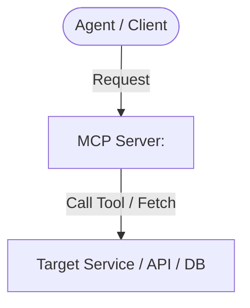

# Skill: Agy-MCP Blueprint Automator (creating-agy-mcps)

This skill automates the blueprinting and deployment pipeline for custom Model Context Protocol (MCP) servers inside the `Agy-MCP` repository.

## When to use this skill
- When the user requests to design, create, or modify an MCP server blueprint.
- When creating custom integrations or tools connecting external APIs/databases to the agent workspace.

---

## 🛠️ MCP Blueprinting & Deployment Workflow

Whenever triggered, you must perform the following actions sequentially and without omission:

### 1. Identify Target Path & Name
- **MCP Name**: Standardize in a lowercase, hyphen-separated name (e.g., `github-integrator`, `local-sqlite-service`).
- **Full Path**: Target `C:/Users/JimmyR/OneDrive/Documentos/Projects/Agy-MCP/mcp-blueprints/<mcp-name>/`

### 2. Create the Directory Structure
Create the required directory hierarchy using forward slashes `/`:
- `mcp-blueprints/<mcp-name>/` (Root)
  - `BLUEPRINT.md` (Architectural details, setup, tool schemas)
  - `schemas/` (Optional: pure JSON files detailing schemas)
  - `templates/` (Optional: config templates or boilerplate code)

### 3. Construct the `BLUEPRINT.md`
Generate `BLUEPRINT.md` using the exact structure below:
```markdown
# MCP Blueprint: <mcp-name>

## Architectural Overview
<Brief description of what this MCP server does and its role in the workspace.>



## System Setup Requirements
- **Docker**: <Indicate if Docker/Docker Compose is needed and setup specs>
- **Dependencies**: <List OS or runtime dependencies, e.g., Node.js >= 18, Python 3.11>

## Environment Setup (`.env.example`)
Create a template listing necessary variables. Ensure NO secrets are hardcoded:
```env
# Server Configurations
PORT=__SERVER_PORT__
LOG_LEVEL=info

# Service Credentials (VAULT-ALIGNED PLACEMARKS)
API_KEY=__VAULT_SECRET_<MCP-NAME>_API_KEY__
DB_CONNECTION_STRING=__VAULT_SECRET_<MCP-NAME>_CONNECTION_STRING__
```

## Tools Schema
Specify all tools exposed by the MCP server in standard JSON schema format:
```json
{
  "tools": [
    {
      "name": "example_tool",
      "description": "Short description of what the tool does",
      "inputSchema": {
        "type": "object",
        "properties": {
          "param1": {
            "type": "string",
            "description": "Required parameter"
          }
        },
        "required": ["param1"]
      }
    }
  ]
}
```
```

### 4. 🔒 Absolute Security Compliance Verification
- **No Raw Secrets**: Ensure NO live production API keys, database passwords, or auth tokens are written into the `BLUEPRINT.md` or `.env.example`. Replace them all with vault-aligned placeholders.
- **Gitignore Check**: Verify that a `.gitignore` exists at `C:/Users/JimmyR/OneDrive/Documentos/Projects/Agy-MCP/` and is active to avoid committing sensitive logs, node_modules, or `.env` files.

### 5. Automated Git Commit & Push
Once the files are fully written, execute the following shell commands in the target repository to finalize deployment:
```powershell
# Change directory to the repository root
cd "C:/Users/JimmyR/OneDrive/Documentos/Projects/Agy-MCP"

# Stage all files
git add .

# Commit with standard conventional commit message
git commit -m "feat(mcp-bp): add blueprint for <mcp-name>"

# Push to central hub
git push origin main
```

---

## Validation Checklist
Before declaring success, verify that:
- [ ] The folder is created at `C:/Users/JimmyR/OneDrive/Documentos/Projects/Agy-MCP/mcp-blueprints/<mcp-name>/.`
- [ ] `BLUEPRINT.md` features the system requirements, Mermaid flowchart, `.env.example` placeholders, and pure JSON tool schemas.
- [ ] Git commit and push completed successfully without any conflicts.
