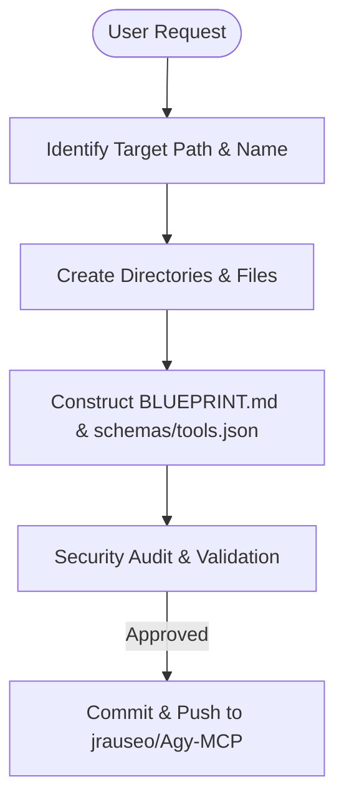

# Skill: Agy-MCP Blueprint Automator

## Goal
Automate the blueprinting, structure generation, and deployment of custom Model Context Protocol (MCP) servers inside the `jrauseo/Agy-MCP` repository, while strictly maintaining security, path isolation, least privilege, and input validation.

## MCP vs Native Fallback

| Capability | With filesystem MCP | Without MCP (Native) |
|---|---|---|
| Create directories / files | Use MCP file write tools | PowerShell: `New-Item -ItemType Directory -Path ...` |
| Git operations | Use git MCP tools | PowerShell: run git commands directly |

---

## When to use this skill
- When the user requests to design, create, or modify an MCP server blueprint.
- When creating custom integrations or tools connecting external APIs/databases to the agent workspace.

## Rules & Constraints
1. **Absolute Security Compliance (Hardened Vanilla)**:
   - **No Hardcoded Secrets**: Use placeholders: `${VAULT_SECRET_<MCP-NAME>_<KEY>}`.
   - **No Production IPs**: Use `${TARGET_HOST}` or `localhost` in configs.
   - **No Raw Shell Exec**: Use array-based argument parsing to prevent shell injection.
   - **Least Privilege**: Scopes must be minimally defined. Read-only by default.
   - **Atomic Writes**: Write to a `.tmp` file and rename to the target destination to prevent corruption.
2. **Path Isolation**: Never hardcode user absolute paths (like `C:/Users/JimmyR/...`). Use placeholders such as `${AGY_MCP_DIR}` or relative paths.
3. **Required Outputs**: Every MCP blueprint must output both `BLUEPRINT.md` and `schemas/tools.json`.

## Workflow Checklist
- [ ] **Identify Target Path & Name**: Standardize in a lowercase, hyphen-separated name (e.g., `github-integrator`). Use target path `${AGY_MCP_DIR}/mcp-blueprints/<mcp-name>/`.
- [ ] **Create Directory Structure**:
  - `${AGY_MCP_DIR}/mcp-blueprints/<mcp-name>/` (Root)
    - `BLUEPRINT.md` (6-section blueprint documentation)
    - `schemas/tools.json` (Machine-readable tools schema with JSON Schema validation)
    - `templates/` (Optional: config templates or boilerplate)
- [ ] **Construct BLUEPRINT.md**: Create the 6-section document covering:
  1. Architectural Overview (Mermaid diagrams)
  2. Setup Requirements (Docker, Node, Python specs)
  3. Environment Configuration (`.env.example` vault-aligned)
  4. Least Privilege Design (minimizing scopes and access privileges)
  5. Atomic Write Strategy (how writes are safely committed via `.tmp` rename)
  6. Deployment / Verification Plan (how to verify tools function)
- [ ] **Construct schemas/tools.json**: Define input parameters using JSON Schema with strict validation constraints (`maxLength`, `pattern` regex, `minimum`/`maximum`, `maxItems`).
- [ ] **Audit Security**: Run the security checklist (least privilege, zero hardcoded secrets, no raw shell execution).
- [ ] **Git Deploy**: Stage, commit, and push changes to `jrauseo/Agy-MCP`.

## Collaboration Workflow


## Templates

### JSON Schema Input Validation Example (`schemas/tools.json`)
```json
{
  "tools": [
    {
      "name": "query_database",
      "description": "Executes read-only queries against database tables.",
      "inputSchema": {
        "type": "object",
        "properties": {
          "table_name": {
            "type": "string",
            "maxLength": 100,
            "pattern": "^[a-zA-Z_][a-zA-Z0-9_]*$",
            "description": "Sanitized table name (alphanumeric & underscore only)"
          },
          "limit": {
            "type": "integer",
            "minimum": 1,
            "maximum": 1000,
            "description": "Maximum number of rows to retrieve"
          }
        },
        "required": ["table_name"]
      }
    }
  ]
}
```

### Git Deployment Commands
```powershell
# Stage all files including blueprint and schemas
git add mcp-blueprints/<mcp-name>/BLUEPRINT.md
git add mcp-blueprints/<mcp-name>/schemas/tools.json

# Commit with standard conventional commit message
git commit -m "feat(mcp-bp): add blueprint and schemas for <mcp-name>"

# Push to jrauseo/Agy-MCP
git push origin main
```

## Resources
- [sec-engineer System Security Mandates](../sec-engineer/SKILL.md)
