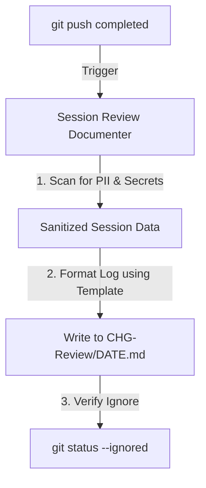

# Skill: Session Review Documenter

## Goal
Manage developer and agent session logs inside a hidden, git-ignored folder (`CHG-Review`), ensuring that all changes are securely documented without leaking PII, secrets, or configurations, and restricting local directory access to the current user.

## MCP vs Native Fallback

| Capability | With filesystem MCP | Without MCP (Native) |
|---|---|---|
| Read/Write files | Use MCP file tools | Use native Read/Write file tools |
| Set directory permissions | Run shell commands via terminal MCP | PowerShell: `Get-Acl` / `Set-Acl` locally |

---

## When to use this skill
- Immediately after any `git push` command is executed in the workspace.
- When compiling daily developer progress logs or session summaries.
- At the end of a long-running agent session to record changes, decisions, and outcomes.
- When asked to set up private change logs or review workflows.

## Rules & Constraints
1. **Hidden and Restricted CHG-Review Folder**:
   - Every project/repository must have a folder named `CHG-Review` at the root. On Windows, mark this directory with the **Hidden** OS attribute.
   - **Access Control Isolation**: To prevent local privilege escalation or information disclosure on multi-user systems, restrict directory permissions so only the owner/current executing user has access (Windows: NTFS ACLs; Linux: `chmod 700`).
2. **Never Push to Git**:
   - The `CHG-Review` directory **MUST NEVER** be tracked or pushed to remote repositories. Ensure `CHG-Review/` is added to the project's `.gitignore` file. Never run `git add` on this folder.
3. **Automatic Log Creation upon Git Push**:
   - Any time you run `git push`, immediately write or append a log file named `DATE.md` (e.g. `2026-05-24.md`) under `CHG-Review/`.
4. **Log Content Security & Sanitization**:
   - **Secrets Scan**: Scan all logs for API keys, passwords, environment variable values, and raw IP addresses before writing. Replace with `[REDACTED]` placeholders in the "Commands Executed" section.
   - **No Error Stack Leaks**: Do not log raw database error tracebacks or system exception logs. Use generic terms and references.
5. **No Hardcoded Paths**: Never include absolute system paths (like `C:/Users/...`) in log files. Use placeholders or relative paths.

## Workflow Checklist
- [ ] **Initialize Workspace**: Ensure `CHG-Review/` exists and is hidden, has restricted user access permissions, and `.gitignore` contains `CHG-Review/`.
- [ ] **Scan Session Context**: Collect all modified files, git logs, and commands run.
- [ ] **Sanitize Context**: Check for PII, secrets, or IP addresses in the captured data.
- [ ] **Format Summary**: Apply the Official Log Template.
- [ ] **Write Log Entry**: Run the helper script or write directly to `CHG-Review/DATE.md`.
- [ ] **Verify Git Status**: Run `git status --ignored` to confirm that the `CHG-Review` folder is correctly ignored.

## Collaboration Workflow


## Templates

### Official Log Template
Every log entry written to the session log must follow this structure:
```markdown
### 🚀 Session Overview
- **Summary:** [Brief description of what was worked on]
- **Changes Made:** [Detailed list of changes made, files modified, and directories updated]
- **Commands Executed:**
  - `git push`
  - [List other commands, ensuring any credentials or secrets are replaced with `[REDACTED]`]

### 💡 Decisions & Context
- [Why specific patterns or libraries were chosen]
- [Architectural adjustments made during the session]

### 🎯 Outcomes & Verification
- [Results of the changes and how they were validated]
- [Status of automated test runs, if applicable]

### 🛡️ Security Notes
- [Document any security evaluations, credential rotations, or hardening performed. Write "None" if clean]
```

## Resources
- **PowerShell Helper Script**: Locate the helper script relatively at `./scripts/docum-helper.ps1` (or use `${DOCUM_HELPER_PATH}`).
- **Initialization Command**:
  ```powershell
  powershell -ExecutionPolicy Bypass -File "./scripts/docum-helper.ps1" -Action Initialize
  ```
- **Log Session Command**:
  ```powershell
  powershell -ExecutionPolicy Bypass -File "./scripts/docum-helper.ps1" -Action LogSession -Summary "YOUR_MARKDOWN_SUMMARY_HERE"
  ```
- [sec-engineer System Security Mandates](../sec-engineer/SKILL.md)
