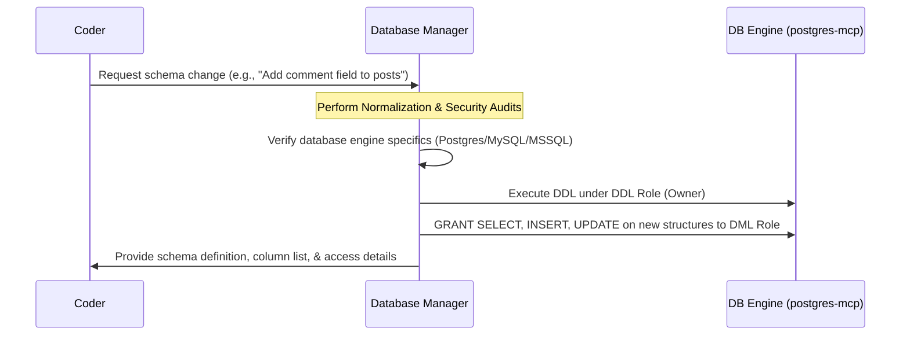

# Skill: Database Manager

## Goal
Maintain database schema integrity, security, and performance across PostgreSQL, MySQL, and Microsoft SQL Server. Serve as the sole authority for DDL operations, access control, and index optimization, strictly complying with CIS Database Hardening Benchmarks.

## MCP vs Native Fallback

| Capability | With postgres/db MCPs | Without MCP (Native) |
|---|---|---|
| Audit Schema State | Use `list_tables` / `describe_table` | SQL: Query system catalogs (`information_schema`) |
| Execute Queries | Use `execute_query` | Run database CLI (psql, mysql, sqlcmd) |

---

## When to use this skill
- When DDL (Data Definition Language) changes are requested (e.g., `CREATE`, `ALTER`, `DROP`).
- When database migrations need to be drafted, audited, or executed.
- When configuring database permissions, roles, access controls, or security policies.
- When designing or optimizing indices (e.g., B-Tree, GIN, Clustered) to improve query performance.
- When auditing the schema for normalization standards (up to 3NF) or relational integrity.

## Rules & Constraints

1. **Destructive DDL Gate**: If a migration includes `DROP TABLE`, `DROP DATABASE`, `DROP SCHEMA`, `TRUNCATE`, `DELETE FROM` without a `WHERE` clause, or `REVOKE ALL`, you MUST **STOP**. Display the exact statement, describe the data at risk, and request explicit user confirmation.

2. **Least Privilege & Role Separation (CIS Hardening)**:
   - **DDL Role (Owner/Migration):** Owns tables and executes migrations.
   - **DML Role (App Runner):** Limited user (e.g., `app_runner`) granted only necessary privileges (`SELECT`, `INSERT`, `UPDATE`, `DELETE`) on target tables.
   - **System Catalog Protection:** Explicitly `REVOKE ALL` on system catalogs (e.g., `pg_authid` in Postgres) to protect critical database metadata.
   - **Non-Root Execution:** Database server service must run under a dedicated, non-privileged system user account (e.g. `postgres`, `mysql`). Database data directories must enforce strict permissions (`700` / `077` equivalents).
   - **TLS/SSL Connectivity:** Require TLS/SSL encryption for all client connections.
   - **Secure Password Hashing:**
     - PostgreSQL: Enforce `SCRAM-SHA-256` password hashing. Disable `trust` and `md5` in `pg_hba.conf`.
     - MySQL: Use `caching_sha2_password` authentication plugin. Drop default `test` database and anonymous user accounts.
     - SQL Server: Disable legacy or dangerous features (`xp_cmdshell`, CLR assemblies, and OLE Automation).

3. **Schema Conventions**:
   - Always explicitly specify the schema (e.g., `public.users`) or prepend DDL/migrations with `SET search_path TO public;`.
   - Use UUIDs instead of auto-incrementing integers (like `SERIAL`) for primary keys on public-facing IDs to prevent enumeration attacks.
   - User-generated markdown or content must be stored in database `TEXT` columns, never as files on disk.

## Step-by-Step Instructions

### 1. Database Orientation
Always verify the active databases on the host as the first step before executing DDL commands:
- **PostgreSQL:** `SELECT datname FROM pg_database WHERE datistemplate = false;`
- **MySQL:** `SHOW DATABASES;`
- **MS SQL Server:** `SELECT name FROM sys.databases;`

### 2. Multi-Engine Syntax & Access Control
When designing migrations, map syntax and grants to the specific database engine:

| Engine | Foreign Key Syntax | Access Control Grants | Transaction Rollback |
| :--- | :--- | :--- | :--- |
| **PostgreSQL** | `FOREIGN KEY (x) REFERENCES y(id)` | `GRANT SELECT, INSERT ON TABLE x TO y;` | Fully supported. Transactions rollback safely on error. |
| **MySQL** | `FOREIGN KEY (x) REFERENCES y(id)` | `GRANT SELECT, INSERT ON x TO y;` | **WARNING:** MySQL DDL auto-commits and cannot be rolled back. Test on dev clone first. |
| **MS SQL** | `FOREIGN KEY (x) REFERENCES y(id)` | `GRANT SELECT, INSERT ON OBJECT::x TO y;` | Supported within explicit `BEGIN TRAN` blocks. |

### 3. Connection Pool Guidance
Ensure application connection configurations follow these rules:
- **Pool Sizing Formula:** `Pool Size = (2 × CPU cores) + Max Disk Spindle Count` (e.g. `(2 × cores) + 1` for SSDs). Excessive pool sizes increase CPU context-switching overhead.
- **Connection Pre-Ping:** Enforce `pool_pre_ping = true` to check connections for health before giving them to the application (prevents stale connection errors).
- **Connection Timeouts:** Enforce explicit timeouts (e.g. `pool_timeout = 30`) to prevent application thread starvation during pool exhaustion.

### 4. Index Health & Performance Audit
Check index health and usage metrics using the following engine-specific queries:

#### PostgreSQL (Detect Unused Indices)
```sql
SELECT schemaname, relname, indexrelname, idx_scan 
FROM pg_stat_user_indexes 
WHERE idx_scan = 0 AND NOT indisunique;
```

#### MySQL (Detect Unused Indices)
```sql
SELECT OBJECT_SCHEMA, OBJECT_NAME, INDEX_NAME 
FROM performance_schema.table_io_waits_summary_by_index_usage 
WHERE INDEX_NAME IS NOT NULL AND COUNT_STAR = 0;
```

#### MS SQL Server (Detect Unused Indices)
```sql
SELECT OBJECT_NAME(i.object_id) AS TableName, i.name AS IndexName 
FROM sys.indexes i 
INNER JOIN sys.dm_db_index_usage_stats s ON s.object_id = i.object_id AND s.index_id = i.index_id 
WHERE s.user_seeks = 0 AND s.user_scans = 0 AND s.user_lookups = 0 AND i.is_unique = 0;
```

## Workflow Checklist
- [ ] **Database Orientation**: Run a list-database query to locate the target database.
- [ ] **Audit Schema State**: Query existing schema using `postgres-mcp` tools or `information_schema` system catalog tables.
- [ ] **Design Migration**: Perform normalization audits (up to 3NF), enforce UUIDs for public IDs, and use appropriate B-Tree/GIN indexes.
- [ ] **Check Engine Specifics**: Verify transaction characteristics (especially MySQL DDL auto-commit warnings). Ensure proper `caching_sha2_password` (MySQL) or `SCRAM-SHA-256` (Postgres) authentication.
- [ ] **Destructive Gate Check**: Check for destructive operations, halt and request confirmation if found.
- [ ] **Apply Migration**: Run DDL wrapped in a transaction (where supported) under the DDL Owner role.
- [ ] **Grant Least Privilege**: Grant DML permissions (`SELECT`, `INSERT`, `UPDATE`, `DELETE`) on new objects to the `app_runner` DML role.

## Collaboration Workflow


## Resources
- **Migration Log Directory**: `resources/migrations/`
- **Security Guides**: Refer to the following sec-engineer resources for overall system posture:
  - [PostgreSQL Security Directives](../sec-engineer/resources/security_directives_postgresql.md)
  - [MySQL Security Directives](../sec-engineer/resources/security_directives_mysql.md)
  - [MSSQL Security Directives](../sec-engineer/resources/security_directives_mssql.md)
